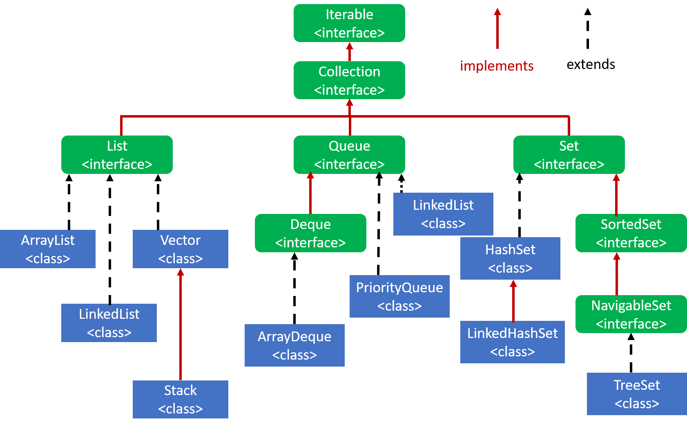

# <div id="headline" style="text-align: center; border: 5px solid gray;">Java Collection framework</div>
## Table of contnet
[Important interface of collection framework](#collectionframework)<br>
[List interface](#listinterface)<br>
[Queue interface](#queueinterface)<br>
[Set interface](#Setinterface)<br>
[ArrayList in java](#arraylistinjava)<br>
[LinkedList in java](#linkedlistinjava)<br>
[ArrayDeque](#arraydeque)<br>
[PriorityQueue](#PriorityQueue)<br>
 




#### <a name = "collectionframework"></a>Important interface of collection framework .

Classes and interfaces of java collection framework are present
in ```java.util``` package.<br>
Let us know about collection interface.<br>
`This classes and interfaces are generic . So they will support andy
object or class.`


|             method             | Description                                                                                                                         |
|:------------------------------:|-------------------------------------------------------------------------------------------------------------------------------------|
|           `add(E e)`           | It will add an element. It can be object of any class                                                                               |
|   `addAll(Collection<E> c)`    | We can pass another collection object. It will add all the element of the object `c`                                                |
|       `remove(Object c)`       | It will remove the object from the collection and return boolean result. If the object is removed, it will return true, else false. |
|  `removeAll(Collection<E> c`   | It will remove all the element of the collection `c`.                                                                               |
|  `retainAll(Collection<E> c`   | In contrast to `removeAll(Collection<E> c)`. That means, remove all the objects except the objects of `c`.                          |
|           `clear()`            | It will remove all the elements of the collection. The collection will be empty.                                                    |
|          `isEmpty()`           | It will check if the collection is empty or not.                                                                                    |
|      `contains(object o)`      | It will check if the object `c` is present or not in the collection.                                                                |
| `containsAll(Collection<E> c)` | It will check if all the element of collection `c` is present in the collection.                                                    |
|            `size()`            | Returns the size of the collection.                                                                                                 |
|          `iterator()`          | It returns an interface of iterator.                                                                                                |
|          `toArray()`           | It will return an array contains all the element of the collection.                                                                 |


### <a name = "listinterface"></a> List interface

```java
interface List extends Collection
```
List represents ordered collection of elements, means there should be index number. It also supports duplicate 
element.
`List interface extends from collection interface.`  So, whatever methods are presented in collection 
interface are also presented in list interface and some extra method. 

|                method                 | Description                                                                                                                                                                                                               |
|:-------------------------------------:|---------------------------------------------------------------------------------------------------------------------------------------------------------------------------------------------------------------------------|
|         `add(int index, E e)`         | It will add an element at the index position of the collection.                                                                                                                                                           |
| `addAll(int index, Collecttion<E> e)` | It will add a collection of elements at the index position of the collection.                                                                                                                                             |
|          `remove(int index)`          | used to remove an element from the specified index from a List container and returns the element after removing it                                                                                                        |
|           `get(int index)`            | used to get an element from the specified index. It does not delete or modify the object.                                                                                                                                 |
|         `set(int index, E e)`         | It will replace the element at the specified index with new element `e`.                                                                                                                                                  |
|      `sublist(int from, int to)`      | It will return a list of elements that are situated in between `from` and `to`.                                                                                                                                           |
|          `indexOf(Object o)`          | It will return the index of the object `o` from the list. If the object is not present in the list, it will return `-1`. This will start searching from left to right side.                                               |
|        `lastIndexOf(Object o)`        | Let's say I have duplicate element in my list. In this case there should be multiple index of the same element.This method will return the last index of this element. This will start searching from right to left side. |
|           `listIterator()`            | `iterator()` from the collection interface allows us to access the element from left to right side. On the other hand, `listIterator()` allows us to access the element in both direction.                                |
|       `listIterator(int index)`       | It allows us to set the pointer to any index we want. All the other functionality of this method is same as `listIterator()`                                                                                              |


## <div name = "Setinterface">Set interface</div>
The set interface does not have any additional method. It only extends the Collection interface.
```java
interface Set extends Collection
```
|              Set               |
|:------------------------------:|
| Unordered collection of object |
|  Unique collection of object   |


## <div name = "queueinterface">Queue interface</div>
This interface supports `FIFO` mechanism. First in first out mechanism. So, elements and objects
are inserted in one end, and deleted in another end. 

|                  method                  | Description                                                                                                                                                              |
|:----------------------------------------:|--------------------------------------------------------------------------------------------------------------------------------------------------------------------------|
|                `add(E e)`                | It will add new element. It will not ask the index number because it needs to maintain `FIFO` mechanism. So, it will add the new element at the end of the last element. |
|                 `poll()`                 | It will remove the first object only. If the queue is empty , this method will return `null` .                                                                           |
| `remove() throws NoSuchElementException` | Same mechanism as poll() except it will throw exception if the queue is empty.                                                                                           |
|                 `peek()`                 | Return the first element of the queue. It will not remove or modify the element. If the queue is empty, it will return null.                                             |
|            `element() throws`            | Same as peek except it will throw exception if the queue is empty.                                                                                                       |


## <div name="arraylistinjava">ArrayList in java</div>
Let us see a demonstration of ArrayList in java. We need to create an object of `ArrayList` first.

```java
import java.util.ArrayList;
public class ListDemo {
    public static void main(String[] args) {
        ArrayList<Integer> al1  = new ArrayList<>();
    }
}
```
As the ArrayList is a generic class, we can define what type of data the list should contain.
I've defined Integer in my list. If we want to store primitive type of data, we should use wrapper 
class for this.

If we want to initialize the size of an arraylist, we can pass the size in the constructor as well.

```java
import java.util.ArrayList;
public class ListDemo {
    public static void main(String[] args) {
        ArrayList<Integer> al1  = new ArrayList<>(50);
    }

}
```

> let us store some data in this arraylist.

```java
import java.util.ArrayList;
public class ListDemo {
    public static void main(String[] args) {
        ArrayList<Integer> al1  = new ArrayList<>(50);
        al1.add(10);
        al1.add(45);
        al1.add(55);
        al1.add(65);
        System.out.println(al1);
    }
}
```
The output of this above code is :<br>
`[10, 45, 55, 65]`

we can also define the index number before adding any element.
```java
import java.util.ArrayList;
public class ListDemo {
    public static void main(String[] args) {
        ArrayList<Integer> al1  = new ArrayList<>(50);
        al1.add(10);
        al1.add(45);
        al1.add(55);
        al1.add(65);
        al1.add(0,59);
        System.out.println(al1);
    }
}
```
The output of this above code is :<br>
`[59, 10, 45, 55, 65]`

We can see that 59 is inserted at 0th index of the al1 arraylist.

We also have `addAll()` method that will add all the element of another arraylist. Let's create
an additional arraylist.
```java
import java.util.ArrayList;
import java.util.List;

public class ListDemo {
    public static void main(String[] args) {
        ArrayList<Integer> al1  = new ArrayList<>(50);

        ArrayList<Integer> al2 = new ArrayList<>(
                List.of(88,99,66,55,44)
        );
        al1.add(10);
        al1.add(45);
        al1.add(55);
        al1.add(65);
        al1.add(0,59);
        al1.addAll(al2);
        System.out.println(al1);
    }
}
```
We've created an arraylist named `al2`.Then we added this arraylist in our previous arraylist
`al1` using `allAll()` method.

The output will be look like this :

`[59, 10, 45, 55, 65, 88, 99, 66, 55, 44]`

If we wanted to add this arraylist at any index number, we could use this method :
```java
import java.util.ArrayList;
import java.util.List;

public class ListDemo {
    public static void main(String[] args) {
        ArrayList<Integer> al1  = new ArrayList<>(50);

        ArrayList<Integer> al2 = new ArrayList<>(
                List.of(88,99,66,55,44)
        );
        al1.add(10);
        al1.add(45);
        al1.add(55);
        al1.add(65);
        al1.add(0,59);
        al1.addAll(5,al2);
        System.out.println(al1);
    }
}
```
Now the output will look like this :

`[59, 10, 88, 99, 66, 55, 44, 45, 55, 65]`

We can also check if any element is present in this list or not.
```java
al1.contains(989)
```
this will return false as 989 is not present in the list.

### Using iterator to iterate through the list
If we want to iterate through a list, we can use iterator to do the job.
```java
import java.util.ArrayList;
import java.util.Iterator;

public class ListDemo {
    public static void main(String[] args) {
        ArrayList<Integer> al1  = new ArrayList<>(50);
        al1.add(10);
        al1.add(45);
        al1.add(55);
        al1.add(65);
        al1.add(0,59);

        Iterator<Integer> it = al1.iterator();
        while(it.hasNext()){
            Integer number = it.next();
            System.out.println(number);
        }
    }
}
```
The `Iterator` is only unidirectional. If we want a bidirectional iterator, we should use `ListIteraot`
instead.

```java
public class ListDemo {
    public static void main(String[] args) {
        ArrayList<Integer> al1  = new ArrayList<>(50);
        al1.add(10);
        al1.add(45);
        al1.add(55);
        al1.add(65);
        al1.add(0,59);
        
        ListIterator<Integer> it2 = al1.listIterator(al1.size());
        System.out.println(it2.previous());
        while(it2.hasPrevious()){
            Integer number = it2.previous();
            System.out.println(number);
        }
    }
}
```
listIterator will set the pointer to the first element if we do not pass any argument. However,
if we pass any index, it will set the pointer to that index position.

## <div name = "linkedlistinjava">LinkedList in java</div>

LinkedList have the same method as ArrayList. In this section, we will see extra two method that  
linkedlist provide.

```java
import java.util.LinkedList;
public class ListDemo {
    public static void main(String[] args) {
        LinkedList<Integer> al1  = new LinkedList<>();
        al1.add(10);
        al1.add(45);
        al1.add(55);
        al1.add(65);
        al1.add(0,59);

        System.out.println("Before adding 78 and 656 : " + al1);

        al1.addFirst(78);
        al1.addLast(656);

        System.out.println("After adding 78 and 656 : " + al1);
    }
}
```
>`addFirst()` method will add the element at the fist position of the linkedlis.
> on the other hand, `addLast()` will add the element at the last position of the linked-list.
> The output will be look like this :

`Before adding 78 and 656 : [59, 10, 45, 55, 65]` <br>
` After adding 78 and 656 : [78, 59, 10, 45, 55, 65, 656]`

We can also get the first and the last element of the linked-list as well. 
```java
public class ListDemo {
    public static void main(String[] args) {
        LinkedList<Integer> al1  = new LinkedList<>(
                List.of(10,45,55,65 )
        );

        al1.add(0,59);
        Integer firstElement = al1.getFirst();
        Integer lastElement = al1.getLast();
        System.out.println("first element : "+
                firstElement+
                "\nLast element : "+lastElement);
    }
}
```
output :<br>
`first element : 59` <br>
`Last element : 65`

`getFirst()` works same as like `peekFirst()` but the main difference is that, `peekfirst()` will
return `null` rather throwing `NoSuchElement` exception. This helps developer to reduce Exception
Handling while development.

## <div name="arraydeque">ArrayDeque</div>
A deque means double ended queue. Elements can be inserted or deleted from both front and rare side.

### Features
- Uses Array data structure.
- Deque can be used as both `stack` and `queue` implementation.
- It takes constant time for adding or removing element. __faster than stack__ .
- Do not support thread. `not thread-safe`

Let us see some implementation of `ArrayDeque`
```java
import java.util.ArrayDeque;

public class DequeDemo {
    public static void main(String[] args) {
        ArrayDeque<Integer> dq = new ArrayDeque<>();

        dq.addLast(10);
        dq.addLast(20);
        dq.addLast(30);
        dq.addLast(40);

        System.out.println(dq);
    }
}
```

| Element |     |     |     |     | 10  | 20  | 30  | 40  |     |     |
|---------|-----|-----|-----|-----|-----|-----|-----|-----|-----|-----|
| Index   | 0   | 1   | 2   | 3   | 4   | 5   | 6   | 7   | 8   | 9   |
```
                                  ------> left to right
```

The starting index should always be form 0.  But for the simplicity, let us assume that elements starts to add at
index 4. Now, the addLast() will add every element after the last available position of this queue. So,
the output of the above code will be :<br>
`[10, 20, 30, 40]`

Let us now add some more element using `addFirst()` method.
```java
import java.util.ArrayDeque;

public class DequeDemo {
    public static void main(String[] args) {
        ArrayDeque<Integer> dq = new ArrayDeque<>();

        dq.addLast(10);
        dq.addLast(20);
        dq.addLast(30);
        dq.addLast(40);

        dq.addFirst(1);
        dq.addFirst(2);
        dq.addFirst(3);
        dq.addFirst(4);

        System.out.println(dq);
    }
}
```
This will add all the elements [1,2,3,4] before `10` .
So, the final queue will look like this.

| Element | 4   | 3   | 2   | 1   | 10  | 20  | 30  | 40  |     |     |
|---------|-----|-----|-----|-----|-----|-----|-----|-----|-----|-----|
| Index   | 0   | 1   | 2   | 3   | 4   | 5   | 6   | 7   | 8   | 9   |
```
            <------------ right to left insertion
```
### Stack implementation using ArrayDeque
Array deque can be used to implement stack. Stack data structure always follow
`LIFO` ( last in first out ) strategy. So, to implement this data structure,
we have to consider two things :
- When we will insert new value, we wil insert it at the last available position.In this case , new value will be inserted at index 8
- When we will delete, we always delete the most recent inserted value. In this case , value of index 7 will be deleted.


If we want to delete from the last index __in this case, index number `7`__ , we 
will use pollLast() medhod. This will mimic `STACK` functionality.

If we want to add new value to this queue, we will use offerLast() method.

Now, we will see an implementation of stack using ArrayDeque

```java
import java.util.ArrayDeque;

public class DequeDemo {
    public static void main(String[] args) {
        ArrayDeque<Integer> dq = new ArrayDeque<>();

        //pushing new value to dq
        dq.addLast(10);
        dq.addLast(20);
        dq.addLast(30);
        dq.addLast(40);

        // pop from dq
        dq.pollLast();

        dq.forEach((x)-> System.out.println(x));
    }
}
```

`If we wanted to implement queue, we would use pollFirst() insted of pollLast() . pollFirst()
removes items that were inserted first.`


## <div name = "PriorityQueue">PriorityQueue</div>
- This class represents a data structure called `Heap` . 
- Implemented using `array`

- A priority queue means elements are inserted or deleted based on priority. Now, how the priority is
defined ? Well, its depends on the value of an element. If the element is small, the priority is high. If the element is large, the priority is low.
- We cannot decide which element should be deleted in this data structure. The highest priority element will be deleted.

- _The heap is implemented using binary tree data structure_ <br>
- _To implement heap, we should implement a method to compare the elements. Otherwise, it may cast
a runtime exception._
```java

import java.util.PriorityQueue;

public class PriorityDemo {
    public static void main(String[] args) {
        PriorityQueue<Integer> p = new PriorityQueue<>();

        //we can use offer() method instead of add method.
        p.add(20);
        p.add(10);
        p.add(30);
        p.add(5);
        p.add(15);
        p.add(3);

        System.out.println(p);

        System.out.println(
                p.peek() //helps to find the head element.
        );


        p.poll(); //remove the head element.

        System.out.println(
                p.element() //gives the head element.
        );

        System.out.println(p);

    }
}

```

Priority queue by default implements min heap. If we want to implement a max heap, we must defince
the priority manually. 
For defining priority, we must implement `Comparator` interface. Let us see an example of max heap.

```java
import java.util.Comparator;
import java.util.PriorityQueue;


class MyCom implements Comparator<Integer> {
    @Override
    public int compare(Integer o1, Integer o2) {
        if (o1 < o2) {
            return 1;
        } else if (o1 > o2) {
            return -1;
        } else {
            return 0;
        }
    }
}


public class PriorityDemo {
    public static void main(String[] args) {
        PriorityQueue<Integer> p = new PriorityQueue<>(
                new MyCom()
        );

        //we can use offer() method instead of add method.
        p.add(20);
        p.add(10);
        p.add(30);
        p.add(5);
        p.add(15);
        p.add(3);

        System.out.println(p);

        System.out.println(
                p.peek() //helps to find the head element.
        );


        p.poll(); //remove the head element.

        System.out.println(
                p.element() //gives the head element.
        );

        System.out.println(p);

    }

}
```


# Hash
Before move on to next few classes, let us talk about hashing technique. Java uses hashing
technique in my classes. Some of them are :
- HashSet
- HashMap
- LinkedHashSet
- LinkedHashMap
- HashTable
- Properties

We will discuss how java uses hashing technique.

| Index | Value |
|-------|-------|
| 0     |       |
| 1     |       |
| 2     |       |
| 3     |       |
| 4     |       |
| 5     |       |
| 6     |       |
| 7     |       |
| 8     |       |
| 9     |       |


 <br>
- Each of the location ( identifying by index number 0....9) are called as buckets. 
- Each bucket can hold just value, or key and value.
- A hash table have some size. **Most of the time the initial size is 16** in may java classes.
- It will adjust the size if the limit is crossed by 16.

Assume we have some values that need to be stored in hash table.

| Syntax |
|--------|
| 15     | 
| 28     |
| 42     |
| 35     |
| 17     |
| 52     |

For adding the values to the hashtable, we have to define the index of each value.
We will calculate the index using a hash function.
For example,

`h(x) = x%10`

Let's say we want to insert 42 in this hash table. We will then calculate the index number using
hash funtion.
The index number is ,
x%10 = 42%10 = 2
So, the value will be stored in second index of the hash table.

| Index | Value |
|-------|-------|
| 0     |       |
| 1     |       |
| 2     | 42    |
| 3     |       |
| 4     |       |
| 5     | 15    |
| 6     |       |
| 7     |       |
| 8     | 28    |
| 9     |       |

>There might be some case when two value have the same index number. For example, 15 and 35
have the same index number 5 . In this case , if index number 5 is empty, we will simply insert
in this empty space. However, if the calculated index is not empty, we need to insert the element in
nearest available space. In this case , if we insert 15 at index 5 and then try to insert 35,
we have to insert at index number 6 since it is the nearest available space.


| Index | Value |
|-------|-------|
| 0     |       |
| 1     |       |
| 2     | 42    |
| 3     |       |
| 4     |       |
| 5     | 15    |
| 6     | `35`  |
| 7     |       |
| 8     | 28    |
| 9     |       |

> Now, when I search 35, I will calculate the index number first. In this case the index number
is 5. If the element is not found at index 05, we need to execute a linear search stars from index
number 5. 

> **What if we search an element that does not exist in the hashmap ? How we will then understand
> that the element does not exists in the hashmap  ? Should we search the whole hashmap ?**<br>
> No.
> 
> Let's say we are searching 45 in this above hashmap. 45 is not present in this table. So, the 
> searching will be executed like this :
> - calculate the index number of 45 using hash function `f(x) = x & 10` = 5
> - Check if 45 is present in index number 6.
> - 45 is not present in index 6.
> - Start a linear search. 
> - Is 45 present at index 6 ? No. Continue linear search.
> - Is 45 present at index 7 ? No. But index 7 is empty ! If 45 presented in this hash function it should occupy next available empty space. But this space is still blank. So, 45 is not present.
> <br>


