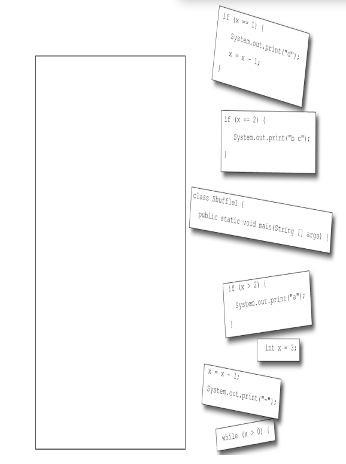

# Code Magnets
***

A working Java program is all scrambled up on the fridge. Can you rearrange
the code snippets to make a working Java program that produces the output
listed below? Some of the curly braces fell on the floor and they were too
small to pick up, so feel free to add as many of those as you need!


## Solution
```java
public class Shuffle1 {
    public static void main(String[] args) {
        int x = 3;
        while(x>0){

            if(x>2){
                System.out.print("a");
            }
            if(x==2){
                System.out.print("b c");
            }
            x=x-1;
            System.out.print("-");
            if(x==1){
                System.out.print("d");
                x=x-1;
            }
        }
    }
}
```


