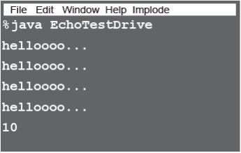
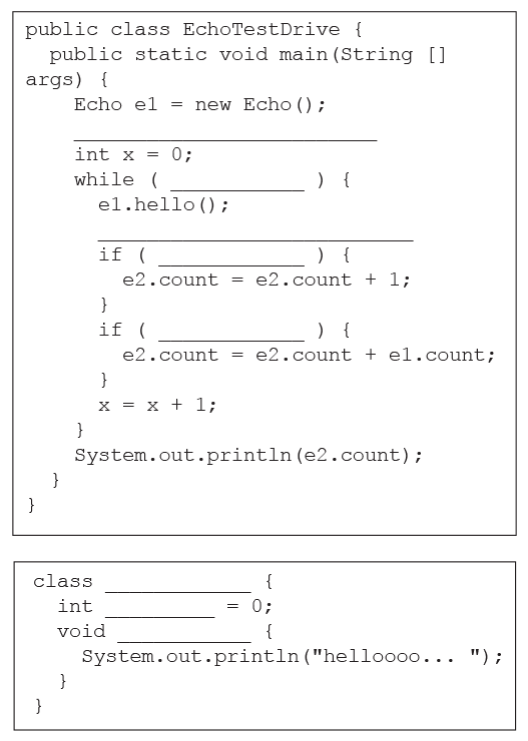
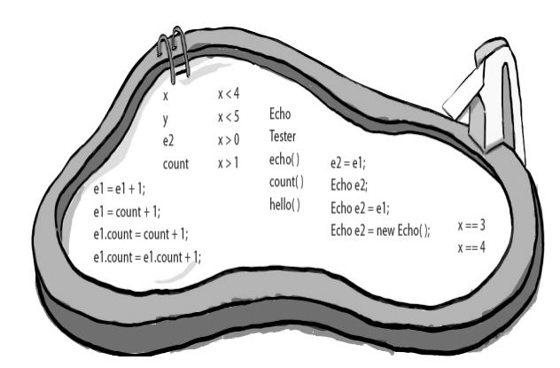

# Pool Puzzle

<p align="center">
  
</p>

> Your job is to take code snippets from the pool and place them into the blank
lines in the code. You may use the same snippet more than once, and you
won’t need to use all the snippets. Your goal is to make classes that will
compile and run and produce the output listed below. Some of the exercises
and puzzles in this book might have more than one correct answer. If you find
another correct answer, give yourself bonus points!
> Output
> 



# `Solution`
```java

```