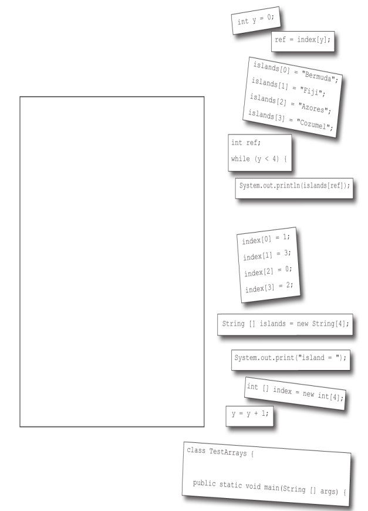
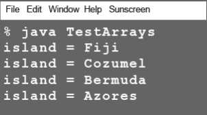

### A working Java program is all scrambled up on the fridge. Can you  reconstruct the code snippets to make a working Java program that produces  the output listed below? Some of the curly braces fell on the floor and they  were too small to pick up, so feel free to add as many of those as you need!



***
### `Solution`
```java
class TestArrays {
    public static void main(String[] args) {
        int[] index = new int[4];

        index[0] = 1;
        index[1] = 3;
        index[2] = 0;
        index[3] = 2;

        String[] islands = new String[4];
        islands[0] = "Bermuda";
        islands[1] = "Fiji";
        islands[2] = "Azores";
        islands[3] = "Cozumel";

        int y = 0;
        int ref;

        while (y < 4) {
            ref = index[y];
            System.out.print("island = ");
            System.out.println(islands[ref]);
            y = y + 1;
        }
    }
}
```
