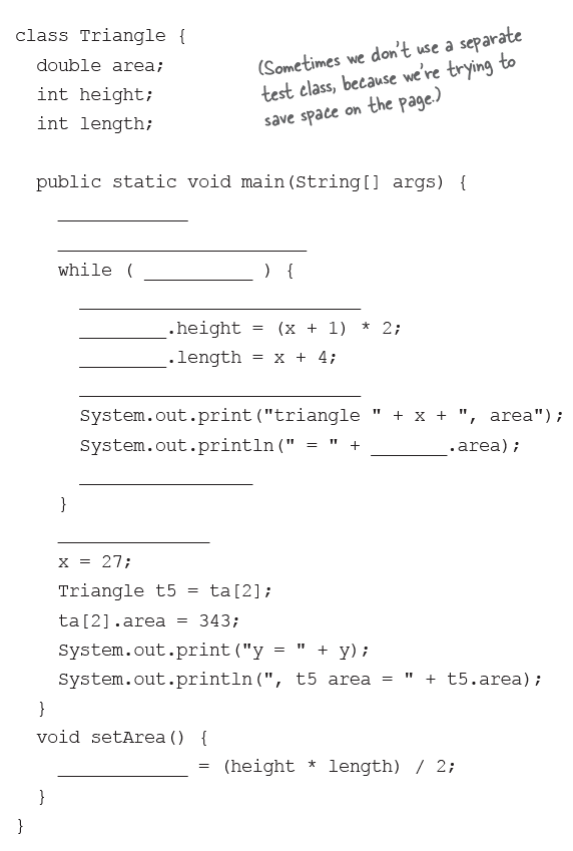
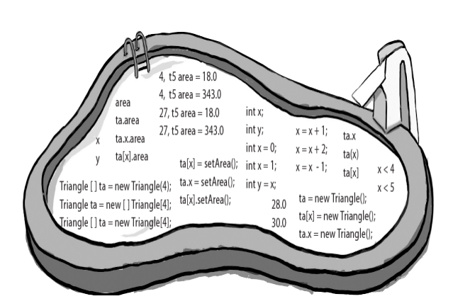

### Your job is to take code snippets from the pool and place them into the blank  lines in the code. You may use the same snippet more than once, and you  won’t need to use all the snippets. Your goal is to make a class that will  compile and run and produce the output listed.



### `solution`

```java

```